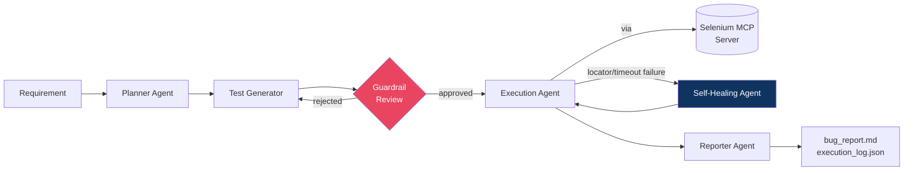

# AI Quality Engineering Framework (AI-QEF)

**An agentic system that automates the full Software Testing Life Cycle —
requirement → test plan → test generation → guardrail review → browser
execution via Selenium MCP → self-healing → bug report — built with
LangGraph, the Model Context Protocol, and Claude.**

> One requirement in. A reviewed, executed, self-healed test run and a
> written bug report out. No human writes a single line of Selenium code.

```bash
pip install -r requirements.txt
python langgraph_agent/graph.py
```
Runs immediately — no API key, no real browser, no live MCP server needed
(uses a scripted LLM client + mock Selenium MCP backend for a fully
reproducible offline demo). See [`demo/README.md`](./demo/README.md) for the
full walkthrough and sample output.

---

## Why this project exists

Most "AI QA" demos show an LLM writing a test script once. This project
demonstrates something closer to how a real QA org operates: **a pipeline of
specialized agents**, each responsible for one phase of the test lifecycle,
with deterministic guardrails at the boundary where any agent touches a real
system, and a self-healing loop for the #1 cause of flaky UI suites —
locator drift.

## Architecture at a glance



Full diagrams and design rationale: [`architecture/`](./architecture/).

## Repository map

| Folder | What's in it |
|---|---|
| [`architecture/`](./architecture/) | System architecture, LangGraph state diagrams, MCP integration design — 3 detailed docs with Mermaid diagrams |
| [`prompt_library/`](./prompt_library/) | Every agent's system prompt, versioned and documented separately from code, with worked examples |
| [`agentic_stlc/`](./agentic_stlc/) | How traditional STLC phases map to agents, what's deliberately not automated, and how bugs are distinguished from flakes |
| [`langgraph_agent/`](./langgraph_agent/) | The actual `StateGraph` definition — nodes, conditional edges, checkpointing, human-approval interrupt |
| [`src/agents/`](./src/agents/) | One file per agent: Planner, Test Generator, Guardrail, Executor, Self-Healer, Reporter |
| [`src/tools/`](./src/tools/) | `MCPToolClient` (real MCP boundary), mock Selenium backend (offline demo), fake/real LLM clients |
| [`guardrails/`](./guardrails/) | Deterministic MCP-call guardrails (URL allow-list, script deny-list) + LLM-based semantic review |
| [`mcp_config/`](./mcp_config/) | Selenium MCP + Filesystem MCP server config, tool allow-lists, domain allow-lists per environment |
| [`evaluation/`](./evaluation/) | Labeled eval set + runner for the guardrail agent (precision/recall), CI-gateable |
| [`devops_flow/`](./devops_flow/) | GitHub Actions CI pipeline — unit tests → guardrail eval → full demo run → artifact upload |
| [`demo/`](./demo/) | Walkthrough + real sample output (`execution_log.json`, `bug_report.md`, full MCP audit trail) |
| [`tests/`](./tests/) | pytest suite: guardrails, executor routing/classification, full graph end-to-end |

## What makes each piece worth asking about in an interview

- **Why LangGraph, not a simple prompt chain** — generation↔guardrail and
  execution↔healing are real cycles, not a straight line. See
  [`architecture/02_agent_workflow.md`](./architecture/02_agent_workflow.md).
- **Two-layer guardrails** — deterministic checks on *every* MCP tool call
  (URL allow-list, destructive-script deny-list, per-test call budget) plus
  an LLM reviewer that runs *once* per generated test for things regex can't
  catch (scope creep, missing assertions, illogical step order). See
  [`guardrails/`](./guardrails/).
- **Self-healing, bounded** — a locator failure gets one honest LLM-proposed
  fix from the live DOM, retried up to 2 times; it never turns into an
  infinite loop, and a genuine assertion failure is *never* routed to the
  healer (that would silently rewrite a test to match a real bug). See
  [`src/agents/self_healer.py`](./src/agents/self_healer.py).
- **Reporter is a summarizer, not a judge** — pass/fail is decided
  deterministically by the Execution Agent; the Reporter only narrates
  results it's given and is explicitly forbidden from inventing failures.
  See [`prompt_library/05_bug_reporter_prompt.md`](./prompt_library/05_bug_reporter_prompt.md).
- **Prompts are evaluated, not just vibes-checked** — a labeled precision/
  recall eval set for the guardrail agent gates CI, so a prompt edit that
  quietly weakens safety gets caught before merge. See
  [`evaluation/`](./evaluation/).
- **MCP as a real architectural boundary, not a buzzword** — every browser
  action is a named, schema'd MCP tool call; swapping Selenium MCP for
  Playwright MCP touches one config file, not agent code. See
  [`architecture/03_mcp_integration.md`](./architecture/03_mcp_integration.md).

## Tech stack

`Python` · `LangGraph` · `Model Context Protocol (MCP)` · `Selenium MCP Server`
· `Claude (Anthropic API)` · `Pydantic` · `pytest` · `GitHub Actions`

## Running the tests

```bash
pip install -r requirements.txt
pytest tests/ -v
python evaluation/run_evals.py --suite guardrail
```

## Running a live read-only smoke test

The default demo remains offline and deterministic. To verify a real public
automation-practice site without using the mock browser backend, run:

```bash
python evaluation/live_site_smoke.py --base-url https://automationexercise.com
```

This performs read-only HTTP checks against public pages only. It does not
sign up, log in, add items to cart, submit forms, or attempt checkout.
Results are written to `demo/sample_run/live_site_smoke.json`.

## Viewing the report dashboard

Generate a self-contained HTML dashboard from the latest demo artifacts:

```bash
python demo/generate_dashboard.py
```

Open `demo/sample_run/dashboard.html` in a browser to view the live smoke
summary, execution results, bug report, and MCP audit trail.

## Project status

This is a portfolio/demo project built to be **honestly runnable end-to-end**
rather than a pile of scaffolding: the graph, agents, guardrails, and mock
MCP backend are real, working code — not pseudocode. Swapping the
`FakeLLMClient`/mock Selenium backend for `RealLLMClient` + a live
`selenium-mcp-server` requires no changes to agent logic (see
[`demo/README.md § 4`](./demo/README.md#4-running-with-a-real-llm--real-selenium-mcp-server)).
