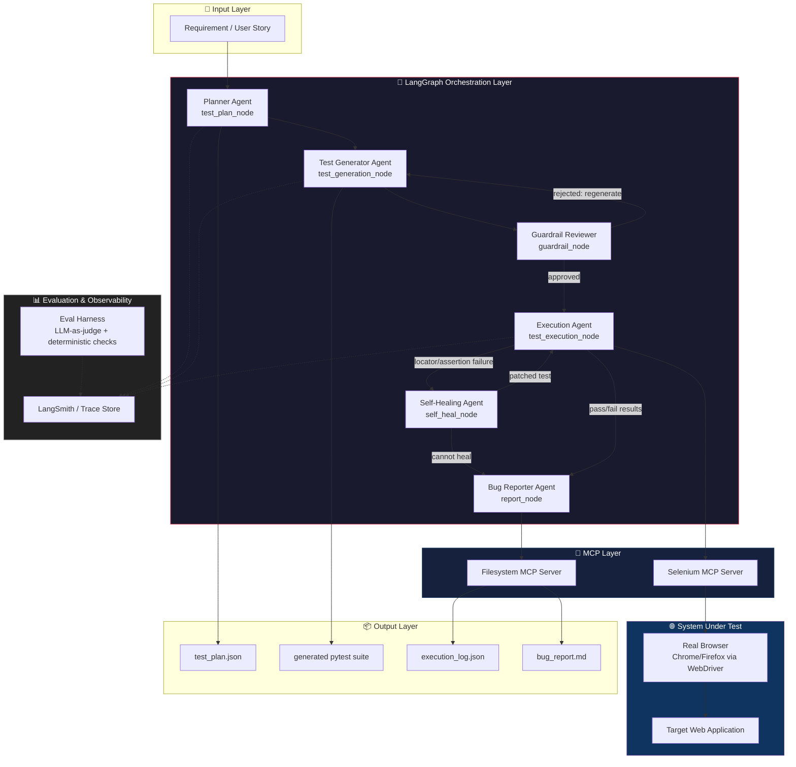
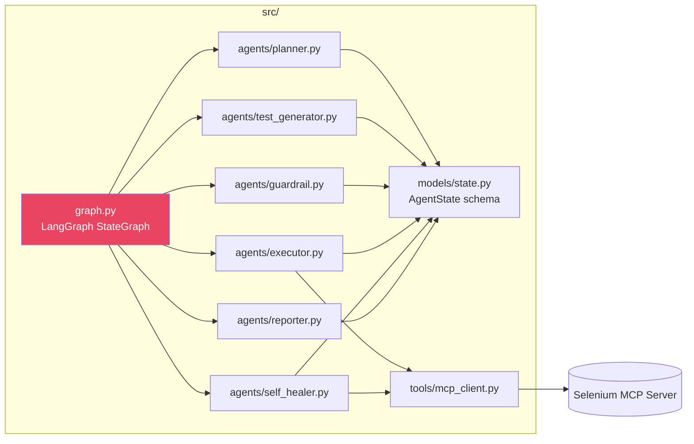

# System Architecture

## 1. High-Level Overview

The **AI Quality Engineering Framework (AI-QEF)** is a multi-agent system that automates
the full Software Testing Life Cycle (STLC) — from a plain-English requirement to an
executed test run and a structured bug report — using **LangGraph** for orchestration,
the **Model Context Protocol (MCP)** for tool access, and **Selenium MCP Server** for
real browser automation.

## 2. Design Principles

| Principle | Why it matters |
|---|---|
| **Agent per STLC phase, not one mega-prompt** | Mirrors real QA process (plan → design → execute → report), makes each step independently testable/evaluable, keeps prompts small and reviewable |
| **MCP as the tool boundary** | Agents never call Selenium directly — they call MCP tools. This decouples "what the LLM decides" from "how automation executes," and lets you swap Selenium MCP for Playwright MCP without touching agent logic |
| **Guardrail node before execution** | An LLM-generated test never touches a real browser unversioned/unreviewed — a deterministic + LLM-judge guardrail checks for destructive actions, PII, scope creep |
| **Self-healing over hard failure** | Locator drift is the #1 cause of flaky UI suites; the healer agent re-inspects the DOM via MCP and patches the locator instead of just failing |
| **Everything is a typed state object** | LangGraph `AgentState` (TypedDict/Pydantic) is the single source of truth passed between nodes — no hidden global state |
| **Human-in-the-loop checkpoint** | Optional interrupt before execution against non-sandbox targets (see `langgraph_agent/graph.py`) |

## 3. Component Map

## 4. Why LangGraph over a plain agent loop

- **Explicit cyclic control flow**: generation ↔ guardrail ↔ regeneration, and execution ↔
  self-healing ↔ re-execution are natural graph cycles, not easily expressed as a linear chain.
- **Checkpointing**: LangGraph's checkpointer lets a run pause at the human-approval gate and
  resume later — useful for CI where execution against staging needs sign-off.
- **Conditional edges** map 1:1 to QA decision points ("did the test pass guardrail review?",
  "is the failure a real bug or a broken locator?").

See [`02_agent_workflow.md`](./02_agent_workflow.md) for the detailed per-node state diagram
and [`03_mcp_integration.md`](./03_mcp_integration.md) for how MCP tool calls are wired in.
