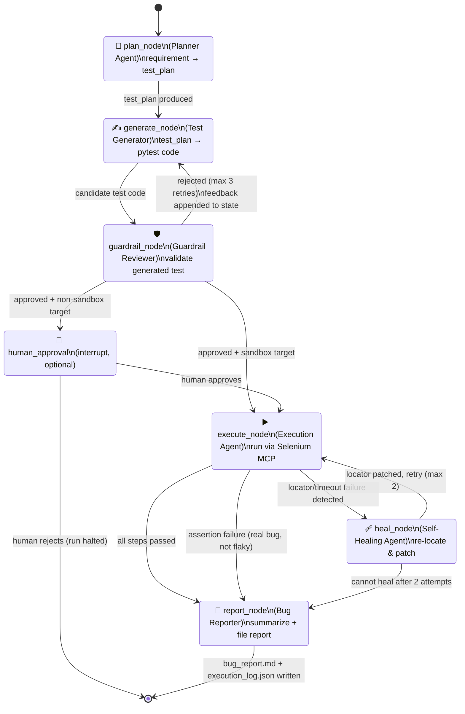
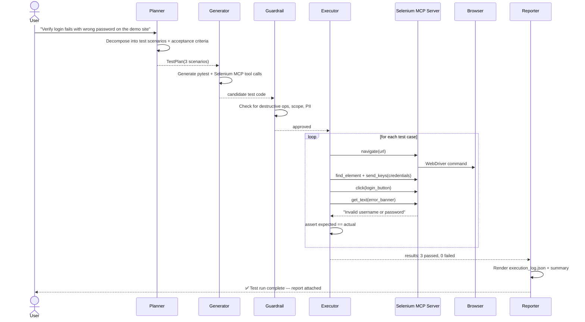
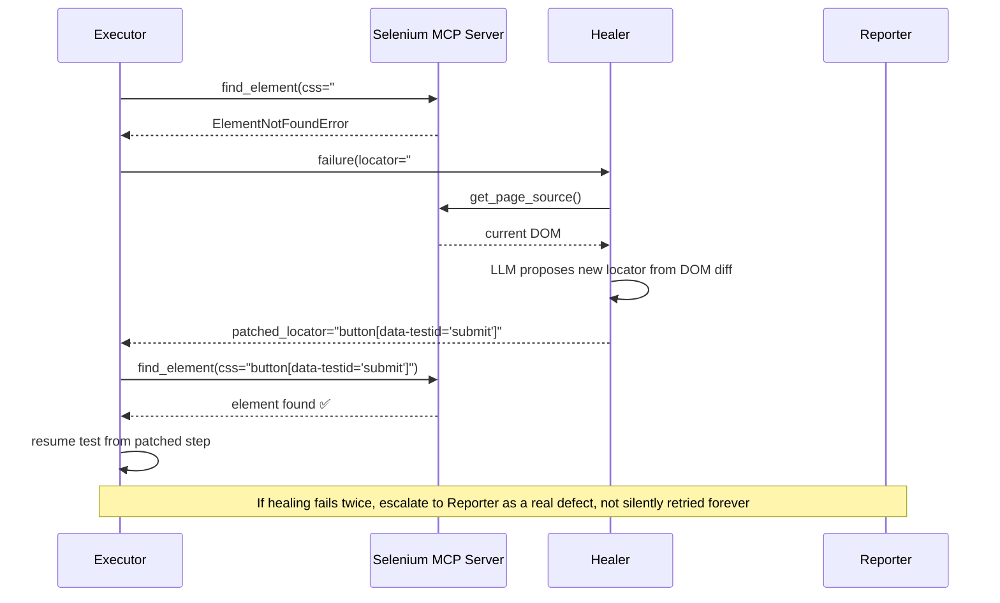

# Agent Workflow — LangGraph State Machine

## 1. Node-Level State Diagram

This is the actual graph implemented in [`langgraph_agent/graph.py`](../langgraph_agent/graph.py).



## 2. AgentState Schema

Single typed object threaded through every node (`src/models/state.py`):

```python
class AgentState(TypedDict):
    requirement: str                    # raw input
    test_plan: TestPlan | None          # structured plan from Planner
    generated_tests: list[TestCase]     # pytest test cases as structured objects
    guardrail_verdict: GuardrailVerdict | None
    guardrail_retry_count: int
    execution_results: list[TestResult]
    healing_attempts: int
    failures: list[TestFailure]
    bug_report: str | None
    target_env: Literal["sandbox", "staging", "production"]
    trace_id: str
```

## 3. Conditional Edge Logic

| Edge decision | Function | Logic |
|---|---|---|
| Guardrail → Generate / HumanGate / Execute | `route_after_guardrail()` | If `verdict.approved is False` and `retry_count < 3` → back to Generate. If approved and `target_env != "sandbox"` → HumanGate. Else → Execute. |
| Execute → Heal / Report | `route_after_execution()` | If failure `reason == "locator_not_found"` or `"timeout"` and `healing_attempts < 2` → Heal. Otherwise → Report. |
| Heal → Execute / Report | `route_after_heal()` | If healer returns a patched locator → Execute (increment `healing_attempts`). If healer returns `None` (no confident fix) → Report. |

## 4. Sequence Diagram — Happy Path Demo Run



## 5. Sequence Diagram — Self-Healing Path


