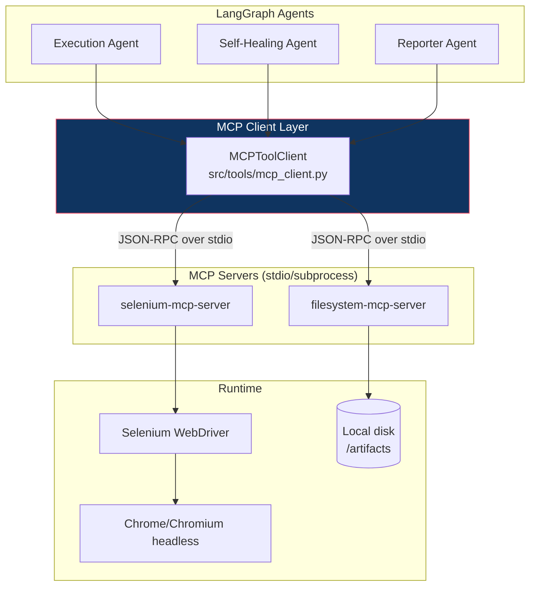

# MCP Integration Architecture

## 1. Why MCP here

The **Model Context Protocol** gives the agent a standardized, discoverable set of tools
instead of hand-rolled function-calling schemas per agent. In this project:

- **Selenium MCP Server** exposes browser actions (`navigate`, `find_element`, `click`,
  `send_keys`, `get_text`, `get_page_source`, `screenshot`, `execute_script`, `wait_for`) as
  MCP tools.
- **Filesystem MCP Server** exposes `write_file` / `read_file` so the Reporter agent can
  persist `bug_report.md` and `execution_log.json` without arbitrary shell access.
- Both are declared once in [`mcp_config/mcp_servers.json`](../mcp_config/mcp_servers.json)
  and consumed by every agent through a single `MCPToolClient` wrapper
  ([`src/tools/mcp_client.py`](../src/tools/mcp_client.py)).

## 2. Tool Contract (Selenium MCP)

Tools the agent can call, as declared to the LLM (see
[`prompt_library/tool_schemas.json`](../prompt_library/tool_schemas.json) for the exact
JSON schema passed in the system prompt):

| Tool | Purpose | Key args |
|---|---|---|
| `navigate` | Load a URL | `url` |
| `find_element` | Locate an element | `by` (css/xpath/id/text), `value` |
| `click` | Click an element | `by`, `value` |
| `send_keys` | Type into an input | `by`, `value`, `text` |
| `get_text` | Read visible text | `by`, `value` |
| `get_page_source` | Full DOM (used by Healer) | — |
| `screenshot` | Capture PNG for evidence | `path` |
| `wait_for` | Explicit wait | `by`, `value`, `timeout_s` |
| `execute_script` | Run JS (guardrail-restricted) | `script` |

## 3. Guardrails at the MCP boundary

MCP gives us a clean interception point. Every tool call from the Executor/Healer passes
through `MCPToolClient.call()`, which enforces (see
[`guardrails/mcp_guardrails.py`](../guardrails/mcp_guardrails.py)):

1. **Allow-list of tool names** — an agent cannot invent a new tool call.
2. **URL allow-list** — `navigate` only permitted to the configured `target_env` domains.
3. **`execute_script` deny-list** — blocks patterns like `localStorage.clear`,
   `fetch(...DELETE...)`, `window.location = <external>`.
4. **Rate limiting** — max N tool calls per test case, to stop infinite retry loops from
   burning tokens/time.
5. **Full audit log** — every call + args + result is appended to `execution_log.json` for
   traceability.

## 4. Why a wrapper client instead of calling the MCP SDK directly in each agent

- Single place to add retries, timeouts, and guardrail checks.
- Agents stay LLM-logic-only; `MCPToolClient` is the only place that knows about JSON-RPC/stdio.
- Makes it trivial to swap `selenium-mcp-server` for a `playwright-mcp-server` later — only
  `mcp_config/mcp_servers.json` and the tool schema change, no agent code changes.

## 5. Local dev vs CI

| Environment | MCP transport | Browser |
|---|---|---|
| Local dev | stdio subprocess | headed Chrome (visual demo) |
| CI (GitHub Actions) | stdio subprocess | headless Chrome via `chromedriver` in runner |

See [`devops_flow/`](../devops_flow/) for the CI pipeline that runs this headless on every PR.
