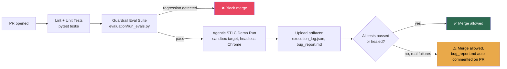

# DevOps Flow — CI/CD Integration

## 1. Pipeline Overview

## 2. GitHub Actions Workflow

See [`ci.yml`](./ci.yml) for the full workflow file. Summary of jobs:

| Job | Trigger | What it does |
|---|---|---|
| `unit-tests` | every push/PR | `pytest tests/test_guardrails.py tests/test_llm_guardrail_reviewer.py tests/test_executor.py` |
| `guardrail-eval` | every push/PR | Runs `evaluation/run_evals.py` against `evaluation/guardrail_eval_cases.jsonl` — fails the build if guardrail precision/recall drops below threshold (catches prompt regressions) |
| `agentic-demo-run` | every PR (uses `FakeLLMClient` — no API key needed in CI) | Runs the full LangGraph pipeline headless, uploads `execution_log.json` + `bug_report.md` as build artifacts |
| `real-llm-smoke-test` | manual trigger / nightly only | Same as above but with `RealLLMClient` + real Selenium against a staging sandbox — requires `ANTHROPIC_API_KEY` secret; gated behind `workflow_dispatch` so it doesn't run (and cost tokens) on every PR |

## 3. Why the demo run uses FakeLLMClient in CI by default

- **Zero flakiness from LLM non-determinism** in the fast PR-gating path — the
  scripted responses are deterministic, so a red CI run always means a real
  code regression, not "the model phrased it differently this time."
- **Zero API cost per PR.** The `real-llm-smoke-test` job (nightly + manual)
  is the one that actually validates prompts against a live model; it's
  intentionally rate-limited/scheduled rather than running on every commit.
- This mirrors a pattern real QA orgs use: fast deterministic checks gate the
  PR, slower/costlier "does the real thing still work" checks run on a
  schedule.

## 4. Artifact retention & traceability

Every CI run's `execution_log.json` (containing the full `MCPToolClient` audit
trail — every tool call, args, result, timing) and `bug_report.md` are
uploaded as workflow artifacts and linked back to the PR, so a reviewer can
inspect exactly what the agent did without re-running it locally.

## 5. Local pre-commit parity

`pre-commit-config.yaml` (optional, see repo root) runs the same
`pytest tests/test_guardrails.py` subset locally before push, so guardrail
regressions are caught before CI, not after.
