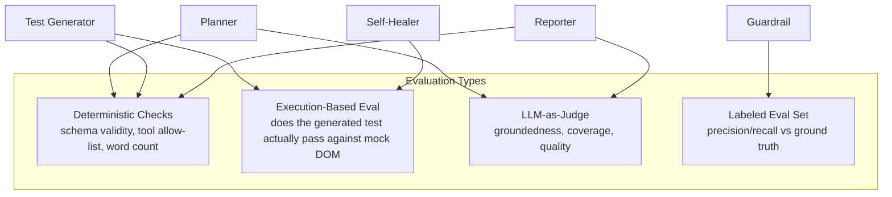

# Evaluation Framework

## 1. What gets evaluated, and how

Not every agent needs the same evaluation strategy. This framework uses
different techniques per node based on what kind of output it produces:

| Agent | Output type | Evaluation method |
|---|---|---|
| Planner | Structured JSON (test plan) | Deterministic schema validation + LLM-as-judge for "did the plan cover the requirement" |
| Test Generator | Executable steps (JSON) | Deterministic checks (valid tool names, has assertions) + execution-based eval (does it actually run against the mock DOM and reach the expected state) |
| Guardrail Reviewer | approve/reject verdict | **Labeled eval set** — `guardrail_eval_cases.jsonl` with known-correct verdicts; precision/recall against ground truth |
| Self-Healer | proposed locator | Execution-based — does the patched locator actually resolve? (mirrors real CI signal) |
| Reporter | Markdown bug report | LLM-as-judge for groundedness (does every claim trace back to the input data) + word count constraint check |



## 2. The Guardrail Eval Set (most important — this is what CI gates on)

`guardrail_eval_cases.jsonl` contains hand-labeled test cases with a known
correct verdict (`approved: true/false`) and the reason. This is the closest
thing to a regression test suite for a prompt — every time
`guardrail/llm_guardrail_reviewer.py`'s prompt changes, re-run
`evaluation/run_evals.py --suite guardrail` and confirm precision/recall
hasn't regressed.

```json
{"test_case": {...}, "expected_approved": false, "expected_violation_contains": "scope creep"}
{"test_case": {...}, "expected_approved": true, "expected_violation_contains": null}
```

Metrics tracked:
- **Precision**: of tests the guardrail approved, what % were actually safe? (false approvals are the dangerous direction — they reach a real browser)
- **Recall**: of tests that should've been rejected, what % did the guardrail catch?
- We explicitly weight **precision higher** — a guardrail that's slightly
  over-cautious (rejects a few safe tests, costing a regeneration cycle) is
  far cheaper than one that lets an unsafe test execute.

## 3. Execution-based eval for the Test Generator

Rather than asking an LLM "does this test look right," we actually run the
generated test against the mock DOM (`tools/mcp_client_mock.py`) and check:
1. Does it execute without a Python exception (valid tool names, valid arg shapes)?
2. Does the final assertion match the known-correct outcome for the fixture
   scenario?

This is strictly more reliable than LLM-as-judge for anything with a
ground-truth execution result — see `evaluation/run_evals.py:eval_test_generator()`.

## 4. LLM-as-judge for groundedness (Reporter)

The Reporter's bug report is graded by a second LLM call that checks: "does
every failure claim in this report correspond to an entry in the
`execution_results`/`failures` input data?" This catches hallucinated defects
— the single most costly failure mode in this pipeline, since a hallucinated
bug report gets filed and wastes an engineer's time.

## 5. Running the evals

```bash
python evaluation/run_evals.py --suite guardrail
python evaluation/run_evals.py --suite all --fail-under 0.90
```

See [`run_evals.py`](./run_evals.py) for the implementation and
[`guardrail_eval_cases.jsonl`](./guardrail_eval_cases.jsonl) for the labeled set.
